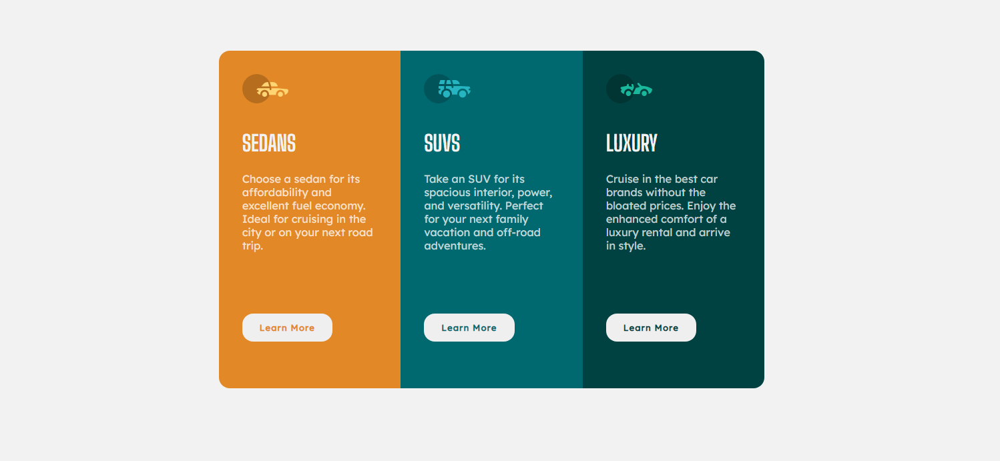

# Frontend Mentor - 3-column preview card component solution

This is a solution to the [3-column preview card component challenge on Frontend Mentor](https://www.frontendmentor.io/challenges/3column-preview-card-component-pH92eAR2-). Frontend Mentor challenges help you improve your coding skills by building realistic projects.

## Table of contents

- [Overview](#overview)
  - [The challenge](#the-challenge)
  - [Screenshot](#screenshot)
  - [Links](#links)
- [My process](#my-process)
  - [Built with](#built-with)
  - [What I learned](#what-i-learned)
  - [Continued development](#continued-development)
- [Author](#author)

## Overview

### The challenge

Users should be able to:

- View the optimal layout depending on their device's screen size
- See hover states for interactive elements

### Screenshot



### Links

- Solution URL: [Add solution URL here](https://github.com/Naveed89-tech/Three-column-component)
- Live Site URL: [Add live site URL here](https://threecolumncomponent.netlify.app/)

## My process

### Built with

- Semantic HTML5 markup
- CSS custom properties
- Flexbox

### What I learned

During the Creating this project, i learn how to use flex.Flex are very help full especially for responsive design.Just one line of code put whole layout into mobile design.

```css
.container {
  flex-direction: column;
}
```

### Continued development

I will more focus on organized code next in developing phase

## Author

- Frontend Mentor - [@Naveed89-tech](https://www.frontendmentor.io/profile/Naveed89-tech)
- Twitter - [@Naveed_Tech_T](https://twitter.com/Naveed_Tech_T)
